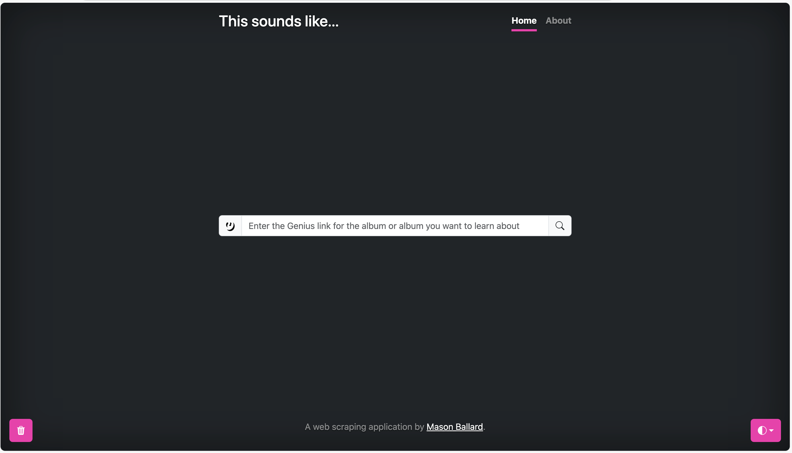
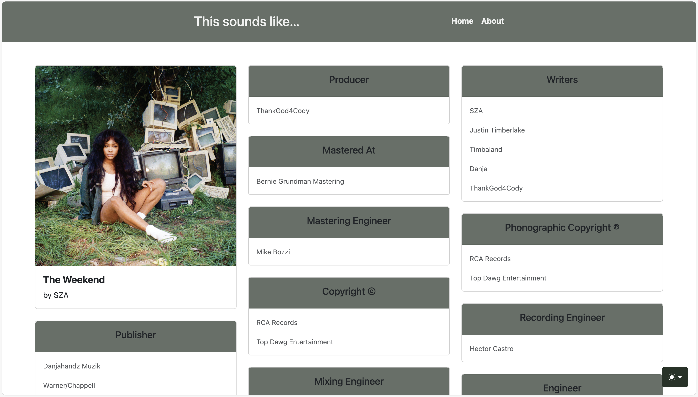

# This sounds like...
### a web application powered by Python, Flask, and BeautifulSoup


Create and activate a python virtual environment, download dependent packages, set flask environment variables, and run. View in `localhost:5000`. See example commands for Mac below.
```bash
source env/bin/activate
export FLASK_APP=app
export FLASK_ENV=development
flask --app app.py --debug run
```





Enter a Genius.com page's url for an album or song to search for who created and contributed to your favorite tracks, get clues to what tracks your favorite songs sampled, and get a sense of what makes a songwriter's or producer's style unique.


View alternate album covers for alongside the credits for each track. Click on the album title or individual track titles to go to the source page on Genius to dig deeper. In dark mode, see how the page adapts to the colors of the primary album artwork.





Look at singles or individual songs to focus on individual production categories.


### About
<h4>What is this?</h4>
<p class="lead">
    A web application that collects the credits of your favorite albums and songs.
</p>
<h4>How?</h4>
<p class="lead">
    The backend is a <code>SQLite3</code> database. The website and it's routes were made with <code>Python Flask</code>. The data, including the album title, artist, tracklist, and the credits, are collected from Genius.com's credits section of each track of an album using <code>BeautifulSoup</code> for webscraping. Each webpage was made by customizing html and css templates from <code>Bootstrap</code>. 
</p>
<h4>Why?</h4>
<p class="lead">
    I wanted to try to explore web scraping. Creating something hosted in a browser application like a web application seemed like it may be able to be up and running sooner. Python is familiar to me, but it also a very flexible language. Genius pages have better attribution data than Spotify, but they are all on separate pages all the way at the bottom of the page. 'How' and 'why' questions drive so much of what I do, and they are also so central to my personality and the way my brain works. I've like music, and I like being able to see if I can tease apart musical influences and identifying features in my favorite works whether that's identifying what makes a melody sound like it was composed by Caroline Polacheck or if a newly released album sounds like it is part of the canon of PC Music pioneered by AG Cook and SOPHIE. All of that starts with getting the data on who did what, and then what connections can be made from there.
</p>
<h4>Usage</h4>
<p class="lead">
    On the home page, enter the link to an album page or song lyrics page from 
    <a href="https://genius.com/" class="link-light">Genius.com</a>. 
    Examples:<br>
    - <code>'https://genius.com/albums/&ltartist name>/&ltalbum name>'</code> like https://genius.com/albums/Oklou/Choke-enough <br>
    - <code>'https://genius.com/&ltartist name>-&ltsong name>-lyrics'</code> like https://genius.com/Sza-the-weekend-lyrics
</p>

<h4>Future improvements</h4>

- [x] Extend functionality to work for singles/specific songs (that don't have album links available)
  - sort of: some song pages don't have album artwork links to be scraped
  - treating individual songs to be scraped as singles (hierarchical table structure) can lead to database bloat and (unhelpful) redundancy (higher normalization)(doesn't degrade performance right now)
  - [x] is the formatting of an album page still the best presentation of info for individual songs, or does it need a unique layout (path)
- [x] Change color of color theme selector to something other than blue
- [x] Utilize Genius's list of alternate album covers to also display on track detail pages
  - data not available in page source, is dynamically loaded (not easily scraped)
- [ ] Host on a publicly available site OR
- [ ] Create desktop application version (ref. https://medium.com/@fareedkhandev/create-desktop-application-using-flask-framework-ee4386a583e9)
  - [ ] add Github (CI/CD like) workflow to deploy and test upon commits
- [x] ~~Create links at the bottom of each track card to visit the actual Genius page, or scrape lyrical content for easy access~~ Added links on album and song pages to reference page - can click on song titles or album title to go to relevant page on Genius
- [ ] Add "go to genius" button on home page (to go to site to get url and come back) (maybe to navbar)
- [x] Color elements of screen based on colors of album (ref. https://www.timpoulsen.com/2018/finding-the-dominant-colors-of-an-image.html)
- [x] Navbar background color on getData page(s)
- [x] Create flush db button for first page (index)
- [x] Refactor using MVC architecture
  - [x] Since flask doesn't really work this way, could at least separate out functionality into other files/controllers (flask likes certain files in certain places, so... segmentation and modular design is not as easy as i'd like)
- [ ] Refactor to use MySQL
- [x] Dynamic web scraping (ref. https://www.zenrows.com/blog/dynamic-web-pages-scraping-python#dynamic-webscraping-using-beautifulsoup)
- [ ] Make detail pages 2 lanes wide, and reserve the third for annotations (would require building out an annotation functionality, refactoring the db schema)
  - [ ] left lane for album cover(s), middle lane for data, lane 3 for annotations
- [ ] Does an album page have a "release date" for albums (versus sporadic release dates listed in credits on each track)?
  - would have to refactor db
- [ ] isolate functionality from views and models
- [ ] in app browser instance with hovering button to collect that page's data
- [ ] make home search bar, actually like kw search, send text to search bar in genius
  - `https://genius.com/search?q=&lt search terms >`
  - special characters reference: https://www.freecodecamp.org/news/url-encoded-characters-reference/

Issues:
- Genius changes the class names of attributes on the page fairly often