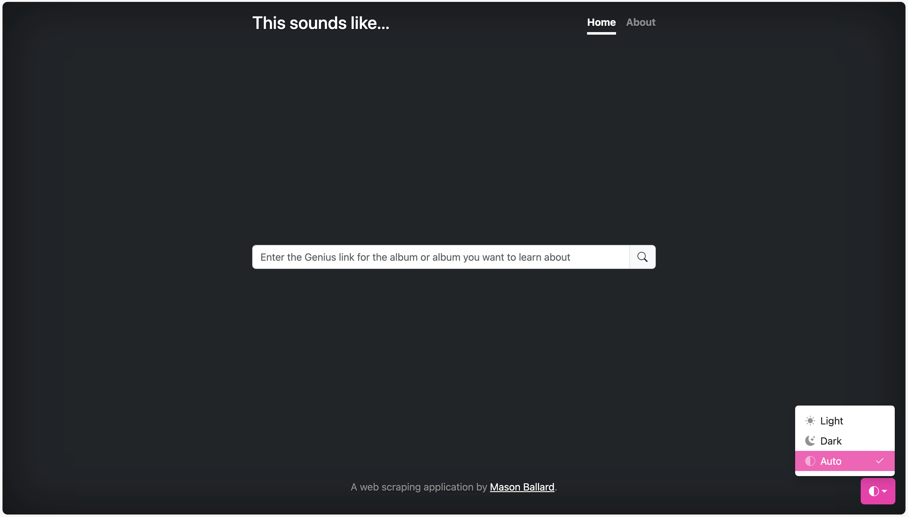
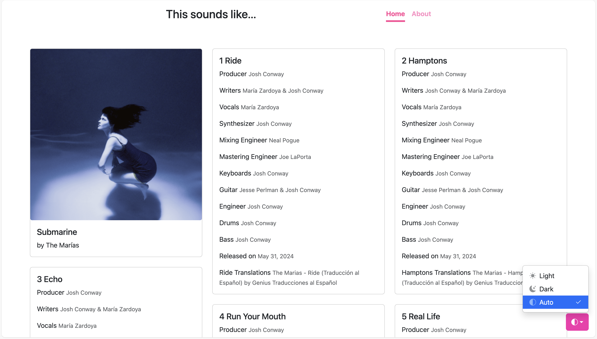

# This sounds like...
### a web application powered by Python, Flask, and BeautifulSoup

Activate a python virtual environment, download dependent packages, set (export) FLASK_APP to `app.py` and FLASK_ENV to `development`, run `flask run`, and open `localhost:5000`

Enter a Genius.com album page's url to search for who created and contributed to your favorite tracks, get clues to what tracks your favorite songs sampled, and get a sense of what makes a songwriter's or producer's style unique.

### About
<h4>What is this?</h4>

    A website that collects the credits of your favorite albums.

<h4>How?</h4>

    The backend is a <code>SQLite3</code> database. The website and it's routes were made with <code>Python Flask</code>. The data, including the album title, artist, tracklist, and the credits, are collected from Genius.com's credits section of each track of an album using <code>BeautifulSoup</code> for webscraping. Each webpage was made by customizing html and css templates from <code>Bootstrap</code>. 

<h4>Why?</h4>

    I wanted to try to explore web scraping. Creating something hosted in a browser application like a web application seemed like it may be able to be up and running sooner. Python is familiar to me, but it also a very flexible language. 'How' and 'why' questions drive so much of what I do, and they are also so central to my personality and the way my brain works. I've like music, and I like being able to see if I can tease apart musical influences and identifying features in my favorite works whether that's identifying what makes a melody sound like it was composed by Caroline Polacheck or if a newly released album sounds like it is part of the canon of PC Music pioneered by AG Cook and SOPHIE. All of that starts with getting the data on who did what, and then what connections can be made from there.

<h4>Usage</h4>

    On the home page, enter the link to an album page from 
    <a href="https://genius.com/" class="link-light">Genius.com</a>. 
    This will take the form of <code>'https://genius.com/albums/&ltartist name>/&ltalbum name>'</code>. 

<h4>Future improvements</h4>

- [ ] Does an album page have a released date for albums (versus sporadic release dates listed in credits on each track)?
- [ ] Utilize Genius's list of alternate album covers to also display on track detail pages
- [ ] Host on a publicly available site
- [ ] Create links at the bottom of each track card to visit the actual Genius page, or scrape lyrical content for easy access
- [ ] Make detail pages 2 lanes wide, and reserve the third for annotations (would require building out an annotation functionality, refactoring the db schema)

